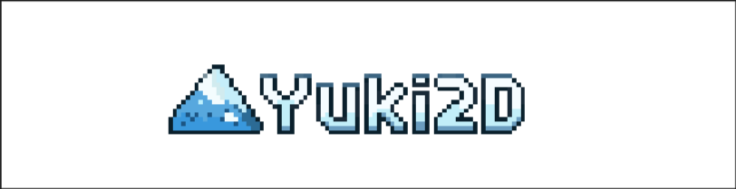

# Yuki2D

Yuki2D is a 2D game engine with a built-in, game-focused scripting language. Think LOVE2D, but with a dedicated language and API you control.

## Build and run
- `cmake -S . -B build && cmake --build build`
- `./run.sh` to build and run the demo (`demo/main.ys`)

## Docs
- Start at `docs/getting-started.md`
- Language basics: `docs/language.md`
- API reference: `docs/api.md`
- Patterns and design notes: `docs/patterns.md`, `docs/design-notes.md`

## Status
Experimental: APIs and language surface will change; use at your own risk. See `docs/changelog.md`.

## License
MIT
